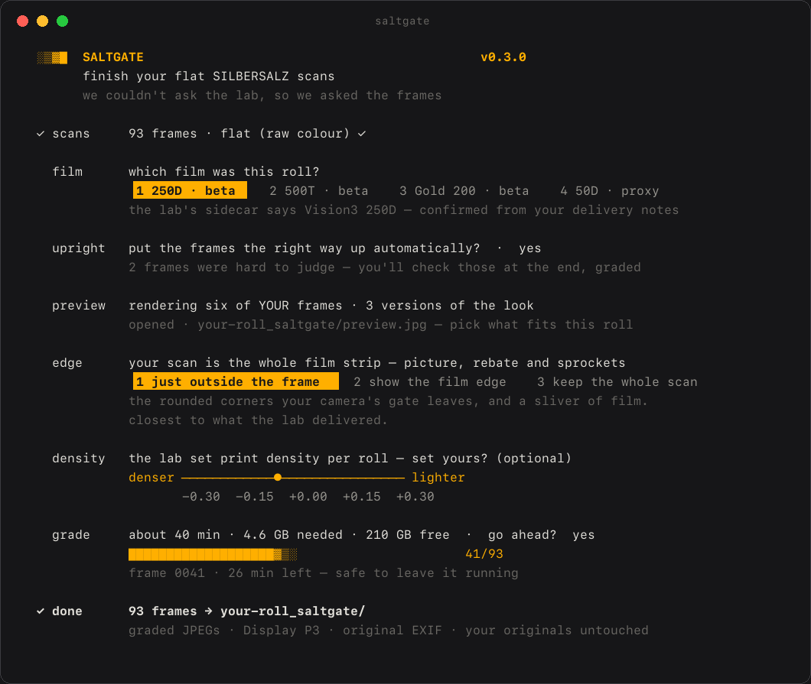

<h1 align="center">SALTGATE</h1>
<p align="center"><b>Open tools for finishing flat SILBERSALZ scans — and preserving a colour workflow photographers love.</b></p>
<p align="center"><i>We couldn’t ask the lab, so we asked the frames.</i></p>
<p align="center">
  <a href="#finish-your-scans">Finish your scans</a> ·
  <a href="#which-films-and-how-close">Which films, how close</a> ·
  <a href="#have-flat-and-graded-scans-of-the-same-frames-get-in-touch">Have pairs? Get in touch</a> ·
  <a href="docs/HOW_IT_WORKS.md">How it works</a>
</p>

<p align="center"></p>

SALTGATE is an independent community project built with appreciation for what SILBERSALZ brought to still photography: motion-picture film, ECN-2 processing, exceptionally detailed scans, and a distinctive approach to colour.

Using contributed flat/graded pairs, we measure parts of that workflow and reconstruct them as open, standard colour transforms (`.cube` LUTs), plus a batch tool that also fixes orientation. The immediate goal is practical: help photographers finish flat scans of photographs that cannot be taken again.

This project is independent and unaffiliated with SILBERSALZ. It contains none of the lab's software, confidential material or proprietary files. It exists because we believe what they created is worth understanding and preserving.

## Why this exists

For a few years, [SILBERSALZ35](https://silbersalz35.com/) was the most interesting thing happening to 35 mm colour film. A small Stuttgart film-production company took Kodak's Vision3 motion-picture stock — the film Hollywood shoots on — respooled it into still cartridges, processed it in real ECN-2 chemistry, and scanned it on a scanner of their own design. What came back was unlike any lab scan most of us had seen: enormous files with the full dynamic range of the negative, and a grade drawn from motion-picture colour work — warm skin, olive greens, soft periwinkle skies, shadows that stayed open and a little warm. People shot their families, their travels and their years on it because of that look.

The lab's own success outgrew it. Demand kept rising, the scanning got more ambitious (the APOLLON 14K scanner from late 2022, a move to a new Berlin lab in 2024), and by 2026 the operation could no longer keep up: staff shortages, months of silence, and hundreds of rolls waiting in a backlog. A customer group of well over a hundred people formed to get negatives back and, through a lot of goodwill on both sides, films were picked up and scans trickled out — but mostly as **flat, ungraded files**, with the grading "to follow". For many of us it never will. As one member put it, what was at stake wasn't money but *photographs that can't be taken again*.

This project is the constructive answer. We take the lab's raw scans and the graded files it did deliver over the years, and reconstruct aspects of the grade as open, standard LUTs — so anyone holding flat scans can finish their rolls toward the familiar SILBERSALZ rendering, in whatever software they use. It is not a replacement for the lab, and it takes nothing away from the people who built that look; it's a community keeping it alive for the pictures already on film. Everything here — the LUTs, the tools, the method and what we learned about how the grade actually worked — is public under MIT.

## Finish your scans

It asks, it shows you, it grades — previews on your own frames before anything is written. No technical knowledge needed; your originals are never modified.

**1. Install** — on a **Mac** (or Linux), open *Terminal* and paste:

```bash
curl -fsSL https://raw.githubusercontent.com/atrouwee/saltgate/main/install.sh | sh
```

On **Windows**, open *PowerShell* (Start menu → type "PowerShell") and paste this one instead:

```powershell
powershell -ExecutionPolicy Bypass -c "irm https://raw.githubusercontent.com/atrouwee/saltgate/main/install.ps1 | iex"
```

**2. Run** — open a **new** terminal window and type:

```bash
saltgate
```

<details><summary><b>"saltgate is not recognised" / "command not found"</b></summary>

Both installers put the `saltgate` command in a folder your terminal only reads when it *starts*, so the window you installed in will never see it. Close that window and open a fresh one.

If a new window still doesn't find it, run the command by its full path — this always works, and tells us the install itself was fine:

- Windows: `%USERPROFILE%\.local\bin\saltgate.exe`
- Mac / Linux: `~/.local/bin/saltgate`

And on Windows, make sure step 1 was the PowerShell line: the Mac line above needs `curl` and `sh`, neither of which Windows has, so pasting it there fails with *"sh is not recognized"* and nothing gets installed. If anything else goes wrong, [open an issue](../../issues) — the version and platform are in the first line of every log file saltgate writes.
</details>

**3. Answer** — the walkthrough guides you through everything, previewing on **your own frames** before anything is written:

<p align="center"></p>

Most of it is automatic — it reads the film stock from the lab's own sidecar, puts sideways frames upright (and shows you the few it wasn't sure about, graded, at the end), crops the film rebate the way the lab did, centred on the film itself. You make the choices that are actually yours to make: which look fits this roll, how much film edge to keep, and — optionally — print density. The graded files (Display P3, original EXIF) land in a new folder next to your originals, which are never touched. **This walkthrough is how the maintainer grades his own rolls.**

> Prefer to stay in your own editor? Every LUT is a standard `.cube`: [use it in Capture One, Resolve, Photoshop, Lightroom and others →](docs/USING_THE_LUTS.md)

## Which films, and how close

| Label | Meaning |
|---|---|
| **Validated** | fitted from genuine flat/graded pairs and evaluated on rolls and donors the fit never saw |
| **Beta** | pair-fitted, but from too few rolls or donors for a broad claim |
| **Proxy** | a stand-in without pairs — statistical approximation from the author's graded archive; the character, not the grade |

Fidelity is stated as the ΔE2000 of the *bare LUT* against the lab's own graded files — what you actually get — under the stated validation. ΔE2000 is a perceptual colour distance: below 1 is indistinguishable, 2–4 a trained eye sees side by side, above 8 is a different grade. "Close" means close under those conditions, not identical. How the number is measured, and what donated pairs measurably buy: [`docs/DELTA_E.md`](docs/DELTA_E.md).

| Stock | LUT | Status | Evidence |
|---|---|---|---|
| **Kodak Gold 200** (C-41) | `silbersalz-gold200_v1-paired_33.cube` | **Beta** — 27 pairs, one donor, two rolls (thanks Cody) | held out a whole roll at a time: median ΔE2000 **4.1** (p90 4.7). The roll-to-roll gap is per-roll density the LUT can't know — more rolls and donors will close it |
| **Kodak ColorPlus 200** (C-41, pushed +2) | `silbersalz-colorplus200_v1-paired_33.cube` | **Beta** — 13 pairs, one donor, one roll (thanks [@_.cherrymy](https://instagram.com/_.cherrymy)) | frame-level holdout median ΔE2000 **4.9** (p90 10.6); black point matches the lab at L\* 4.1. The roll was **pushed +2 stops**, so this LUT describes pushed ColorPlus under the lab's grade — a normal-dev roll will differ, and the walkthrough's mismatch check will say so |
| **Vision3 500T** | `silbersalz-500t_v1.1-paired_33.cube` | **Beta** — 5 pairs, one donor, one roll (thanks Faraz) | frame-level holdout median ΔE2000 **1.5** (p90 6.1; one frame where the lab lifted black by ~0.04); training residual ≤1.1 in every band; black point within 0.1 L\*. Needs a second roll to become *validated* |
| **Vision3 250D** | `silbersalz-250d_v4-jxl_33.cube` | **Beta** — 22 pairs, two donors, four rolls (thanks Sebastian and Lukas Walter) | held out a whole roll at a time: median ΔE2000 **7.9**, a *cross-donor* figure. Give every frame its own exposure and it lands at **0.8** — the pairs are now the lab's own JXL originals rather than re-encoded JPEG, so that number is no longer measured through a compression floor. Training residuals: skin 0.7, shadows 0.9, no band above 1.9. What remains between rolls is density, which no LUT can know — nudge exposure to taste |
| Vision3 250D — archive-matched | `silbersalz-250d_v0.1-statistical_33.cube` | **Proxy** — the alternative | the pre-pairs stand-in, estimated from ~700 of the author's own graded frames. It has no ground truth behind it, but it renders ~10 b\* cooler and ~10 L\* darker than the pair fit, and on the author's own rolls that reads closer. Which is right for a given roll is not measurable without pairs from it, so both ship and the walkthrough asks |
| **Vision3 50D** | `silbersalz-50d_v0-statistical_33.cube` | **Proxy** — no pairs, thin | same method as 250D on the author's three graded 50D rolls (~100 frames); the source distribution is the 250D flat roll, since no 50D flats exist |
| Vision3 200T | borrows `silbersalz-500t_v1.1-paired_33.cube` | **Beta (500T)** — no 200T pairs | same tungsten-balanced family; borrowed within the family. Measured: the two daylight stocks' renders sit 3.3 ΔE apart, daylight vs tungsten 23 ΔE — so borrow within the family, never across. Own pairs would replace it |
| 125T Special ("Edition Vivid") | borrows `silbersalz-500t_v1.1-paired_33.cube` | **Beta (500T)** — no 125T pairs | tungsten-balanced, a Fuji stock rather than Vision3 (the lab's own wording: "the Fuji 125T"; [review](https://phillipreeve.net/blog/analogue-adventures-part-36-silbersalz35-125t-edition-vivid/)) — so the 500T LUT is the nearest family we have, with a larger expected deviation. (Gold ↔ Vision3 does *not* transfer — different curves) |
| other C-41 stocks the lab scanned | — | needs pairs | — |

The walkthrough shows the same words next to each film: **validated** · **beta** · **proxy** · **proxy (250D)**.

Where a stock has more than one credible LUT, there is no single right answer and the tool does not pretend otherwise: the walkthrough renders each one on six of *your* frames, side by side, and asks which you prefer before writing anything. Your choice is remembered locally and never leaves your machine. On the command line, `saltgate looks` lists them and `saltgate apply --look 250d:paired` picks one.

The lab's APOLLON scanner reached customers in September 2022; all LUTs so far are for **APOLLON-era raw files** (≈14000 px wide). Earlier deliveries (5900 × 3800 px, "classic" scanner) came from a different scanner and will need their own pairs. Full history: [`luts/CHANGELOG.md`](luts/CHANGELOG.md).

<details><summary><b>About SILBERSALZ35 (context)</b></summary>

SILBERSALZ Film GmbH was founded in 2011 as a commercial film-production company and moved into analog stills with SILBERSALZ35: Vision3 50D / 250D / 200T / 500T (plus a tungsten Fuji-based "125T Special / Edition Vivid"), ECN-2 processing, and scanning. From late 2022 the scans came from APOLLON, a custom scanner built around a 150-MP Phase One sensor array, delivered as a 4K gallery with a paid full-resolution upgrade (the `HIGH` / `FULL` in the filenames), 16-bit JP2/JXL plus 8-bit JPG, tagged Display P3. Graded files were the default; "raw colour" flats were available on request — and became the only thing many customers got in 2026. Sources: Kodak's [feature on the service](https://www.kodak.com/en/motion/blog-post/silbersalz35/), the lab's product pages, and customers' delivery archives.
</details>

## Have flat *and* graded scans of the same frames? Get in touch

Pairs are what turn a proxy LUT into a validated one — especially for the Vision3 stocks. If the lab delivered any of your frames both flat and graded (or you received flats in 2026 and the graded versions arrive later — keep both), please reach out to me, Adriaan: [open an issue](../../issues) or message me in the Silbersalz community group. I'll tell you exactly which files to send; they're used only to fit the transform and never published. **More pairs, less guesswork.**

## What this is — and isn't

SALTGATE **is**:

- an independent, open-source colour-reconstruction project;
- based on measurements from contributor-owned flat/graded deliveries;
- intended to help finish existing photographs and preserve technical knowledge;
- explicit about which results are validated, beta, proxy or experimental.

SALTGATE **is not**:

- affiliated with or endorsed by SILBERSALZ;
- a copy of the lab's software or scanning pipeline;
- a publication of donated photographs or proprietary material;
- evidence that every creative decision made by the lab reduces to one LUT;
- an attempt to diminish or replace the people who created the original workflow.

## Why "SALTGATE"?

Silver salts sit at the heart of analogue photography. The "-gate" is a small community wink at an unexpectedly complicated chapter in this story.

It is not an accusation. SALTGATE is a preservation project: appreciative of the original work, honest about what can and cannot be reconstructed, and focused on helping people complete their photographs.

## With appreciation

SALTGATE would not exist without the work of the people who created SILBERSALZ35, its scanning systems and its colour workflow. Making motion-picture film and ECN-2 processing approachable for still photographers introduced many people to a way of working they would otherwise never have experienced.

This project is our way of taking that influence seriously: studying it carefully, crediting its source, and helping the resulting photographs survive an uncertain moment.

**And it runs on donated pairs.** Every fidelity number in this README exists because five photographers sent in flat and graded scans of the same frames:

- **Sebastian** — the first 250D pairs, when there was nothing to measure against
- **Lukas Walter** ([@lukas.onfilm](https://instagram.com/lukas.onfilm)) — 16 250D pairs, later re-sent as the lab's own 16-bit originals, which removed a compression floor from every measurement
- **Cody** — 27 Gold 200 pairs across two rolls
- **Faraz** — the 500T pairs
- **[@_.cherrymy](https://instagram.com/_.cherrymy)** — 13 ColorPlus 200 pairs from a Cairo roll, the first C-41 consumer stock donation after Gold — and the roll that taught the walkthrough to check for stock mismatches

Their images are never published — a credit is not permission to republish someone's photographs — only the measurements are. If you have pairs of your own, [you can move a whole film stock from *proxy* to *measured*](#have-flat-and-graded-scans-of-the-same-frames-get-in-touch).

## How it was built

In six days of August 2026, by one photographer and an AI working together — and the ledger is worth being transparent about. The human side: **481 messages, roughly ten hours of judgement** — choosing the look in blinded sittings, catching a colour bug and a crop bug the numbers missed, and every call of taste. The AI side: **~50 hours of work** — 2.7 billion tokens of context read, 8 million written, 156 commits, four releases, and ten-odd CPU-hours of grading, fitting and rendering on a single Mac. Every measurement came from the machine; every judgement that couldn't be measured came from a person. The mistakes that mattered most were caught by eye.

## Independence, privacy, trademark, license

What changed between versions: [`CHANGELOG.md`](CHANGELOG.md).

Auto-rotation uses a ResNet-50 backbone from torchvision (BSD-3-Clause, trained on ImageNet-1K) and the YuNet face detector from OpenCV Zoo — provenance and licences in [`THIRD-PARTY-NOTICES.md`](THIRD-PARTY-NOTICES.md).

Built by Adriaan Trouwee with the Silbersalz community. Pairs: Sebastian and Lukas Walter (250D), Cody (Gold 200), Faraz (500T) — donated images are never published; pair identifiers in the shipped statistics are anonymised. Independent of and unaffiliated with SILBERSALZ Film GmbH; "SILBERSALZ" and "SILBERSALZ35" are the lab's names, used here descriptively. The LUTs contain no image content. Code and LUTs: **MIT**.

How it works: [docs/HOW_IT_WORKS.md](docs/HOW_IT_WORKS.md) · how close the results are, and what donated pairs measurably buy: [docs/DELTA_E.md](docs/DELTA_E.md) · using the LUTs in your own editor: [docs/USING_THE_LUTS.md](docs/USING_THE_LUTS.md). A dated timeline of what happened at the lab, and what its deliveries looked like era by era, kept separate on purpose: [docs/CONTEXT.md](docs/CONTEXT.md).
