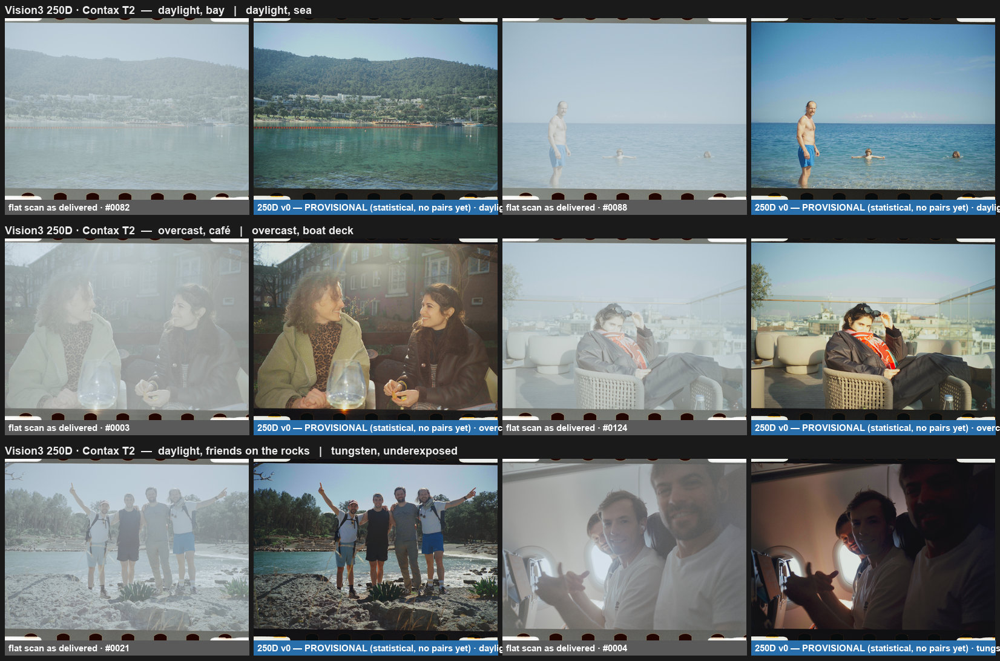

<h1 align="center">open-silbersalz</h1>
<p align="center"><b>The SILBERSALZ35 lab look, reconstructed — for the flat scans the lab never got to grade.</b></p>
<p align="center">
  <a href="#get-the-look-in-5-minutes">Get the look</a> ·
  <a href="#what-exists-and-how-good-it-is">LUTs &amp; fidelity</a> ·
  <a href="#help-we-need-vision3-pairs">Donate pairs</a> ·
  <a href="#for-tinkerers-run-the-tools">Run the tools</a> ·
  <a href="docs/FINDINGS.md">What we learned</a>
</p>

<p align="center"></p>

## Why this exists

For a few years, [SILBERSALZ35](https://silbersalz35.com/) was the most interesting thing happening to 35 mm colour film. A small Stuttgart film-production company took Kodak's Vision3 motion-picture stock — the film Hollywood shoots on — respooled it into still cartridges, processed it in real ECN-2 chemistry, and scanned it on a scanner of their own design. What came back was unlike any lab scan most of us had seen: enormous files with the full dynamic range of the negative, and a grade drawn from motion-picture colour work — warm skin, olive greens, soft periwinkle skies, shadows that stayed open and a little warm. People shot their families, their travels and their years on it because of that look.

The lab's own success outgrew it. Demand kept rising, the scanning got more ambitious (the APOLLON 14K scanner from 2023, a move to a new Berlin lab in 2024), and by 2026 the operation could no longer keep up: staff shortages, months of silence, and hundreds of rolls waiting in a backlog. A customer group of well over a hundred people formed to get negatives back and, through a lot of goodwill on both sides, films were picked up and scans trickled out — but mostly as **flat, ungraded files**, with the grading "to follow". For many of us it never will. As one member put it, what was at stake wasn't money but *photographs that can't be taken again*.

This project is the constructive answer. We take the lab's raw scans and the graded files it did deliver over the years, and reconstruct the grade as open, standard LUTs — so anyone holding flat scans can finish their rolls the way they were meant to look, in whatever software they use. It is not a replacement for the lab, and it takes nothing away from the people who built that look; it's a community keeping it alive for the pictures already on film. Everything here — the LUTs, the tools, the method and what we learned about how the grade actually worked — is public under MIT.

## Get the look in 5 minutes

1. **Find your stock** in the table below and download its `.cube` from [`luts/`](luts/) (or the latest [release](../../releases)).
2. **Apply it to the untouched flat scan** — the lab's `…_RAW_COLOR.jpg` / raw delivery, before any adjustment of your own. The LUT expects exactly that file (Display P3 tagged) and outputs the look in Display P3.
3. Follow the two-line recipe for your app in **[docs/USING_THE_LUTS.md](docs/USING_THE_LUTS.md)** — Capture One, DaVinci Resolve, Photoshop, Affinity, Lightroom (via a Camera Raw profile), darktable, RawTherapee.
4. Nudge exposure ±0.1–0.2 stop to taste if needed. (The lab also applied a small per-roll density and per-frame black adjustment — on the order of ±0.04 stop — which nothing here reproduces automatically; we measured that automatic balancing does more harm than good, so the tools apply the LUT as-is.)

> **Rotation:** the lab's raw scans are delivered in film-strip orientation. The LUT doesn't care; if you want whole rolls upright automatically, see the batch tool below.

## What exists, and how good it is

Honest labels. *Paired* LUTs are fitted on real raw/graded pairs of the same frames and validated on rolls the fit never saw (ΔE2000 of the bare LUT, no per-frame tweaks — what you actually get). *Provisional* LUTs are statistical approximations — the character, not the grade. Fidelity numbers come with their data basis; a LUT from one donor's two rolls is a **first beta**, not a finished reconstruction.

| Stock | LUT | Status | Fidelity |
|---|---|---|---|
| **Kodak Gold 200** (C-41) | `silbersalz-gold200_v1-paired_33.cube` | **Paired, beta** — 27 pairs, one donor, two rolls (thanks Cody) | leave-one-roll-out median ΔE2000 **4.1** (bare LUT), p90 4.7; 1.4 with an oracle per-frame density/black (upper bound). Frame-level (same rolls) 1.7. Close to the lab's files on its own rolls; the roll-to-roll gap is per-roll density the LUT can't know — more rolls/donors needed |
| **Vision3 250D** | `silbersalz-250d_v0-statistical_33.cube` | Provisional — no pairs yet | matches tone and cast; renders skin ~8 L\* lighter and skies ~7 L\* darker than the lab |
| Vision3 250D | `silbersalz-250d_v1-bridged_33.cube` | Experimental — Gold look + statistical bridge | not recommended (colour cast) |
| Vision3 50D / 200T / 500T / 125 Special | — | **needs pairs** | — |
| other C-41 stocks the lab scanned | — | needs pairs | — |

The lab introduced its APOLLON scanner in 2023; all LUTs so far are for **APOLLON-era raw files** (14012 × 10508 px). Earlier deliveries came from a different scanner and will need their own pairs. Full history: [`luts/CHANGELOG.md`](luts/CHANGELOG.md).

<details><summary><b>About SILBERSALZ35 (context)</b></summary>

SILBERSALZ Film GmbH was founded in 2011 as a commercial film-production company and moved into analog stills with SILBERSALZ35: Vision3 50D / 250D / 200T / 500T (plus a "125 Special"), ECN-2 processing, and scanning. From 2023 the scans came from APOLLON, a custom scanner built around a 150-MP Phase One sensor array, delivered as a 4K gallery with a paid full-resolution upgrade (the `HIGH` / `FULL` in the filenames), 16-bit JP2/JXL plus 8-bit JPG, tagged Display P3. Graded files were the default; "raw colour" flats were available on request — and became the only thing many customers got in 2026. Sources: Kodak's [feature on the service](https://www.kodak.com/en/motion/blog-post/silbersalz35/), the lab's product pages, and customers' delivery archives.
</details>

## Help: we need Vision3 pairs

One thing turns a provisional LUT into a real one: **frames the lab delivered both raw and graded**. If you received flat scans in 2026 and the lab later sends the graded versions of the same roll, **keep both** — that's a perfect pair set. Five to ten frames of a stock are enough for a first LUT; a mix of light (sun, shade, tungsten, flash, under/over-exposed) and some people in them help most. The graded `.jxl` beats the `.jpg` if you have it.

**[How to donate pairs →](docs/DONATING_PAIRS.md)** (what to send, how it's used, privacy — images are used only to fit the transform and are never published.)

## For tinkerers: run the tools

```bash
pipx install open-silbersalz            # core: numpy/scipy/pillow/opencv
pipx inject open-silbersalz torch torchvision   # optional: content-based auto-rotation

sslook apply --lut silbersalz-gold200_v1-paired_33.cube --in ~/scans/roll12      # grade a folder -> Graded_v1-paired/
python scripts/auto_rotate.py --in ~/scans/roll12 --out rotations.json --sheet review.jpg
sslook apply --lut ... --in ~/scans/roll12 --rotations rotations.json

sslook validate-pair pairs/you/frame017/          # check a donated pair (alignment, sample count)
sslook fit-pairs --pairs pairs --stock 250d --holdout --out luts/silbersalz-250d_v1-paired_33.cube
sslook export-hald luts/...cube                   # HaldCLUT PNG for RawTherapee / G'MIC
```

Memory-aware by default (147-MP frames are processed in strips, 2–3 workers). Pairs go in `pairs/<donor>/<name>/{flat.*, graded.*, meta.yaml}`; every fit prints a per-band / per-hue residual table and writes a labeled fit-check sheet. Details: [docs/METHOD.md](docs/METHOD.md).

## What we learned

The pairs settled what the lab actually did: a **global, colour-only transform** (no local contrast, no sharpening), tiny **per-roll density** and **per-frame black** adjustments (≈ ±0.04 stop), and **no per-shot white balance** — golden light stays warm, overcast stays cool. Every stock has its own raw encoding, so LUTs don't transfer between stocks; statistics can match tone but not the colour structure of the look. And a lesson at our own expense: automatic per-frame "balancing" made results worse than the bare LUT, so it's off. The full research log with numbers: **[docs/FINDINGS.md](docs/FINDINGS.md)**.

## Credits, privacy, license

Built by Adriaan Trouwee with the Silbersalz community. Pairs: Cody (Gold 200). Donated images are used only for fitting and never redistributed; the LUTs contain no image content. Code and LUTs: **MIT**. "SILBERSALZ35" is the lab's name, used here descriptively; this is an independent community project.
